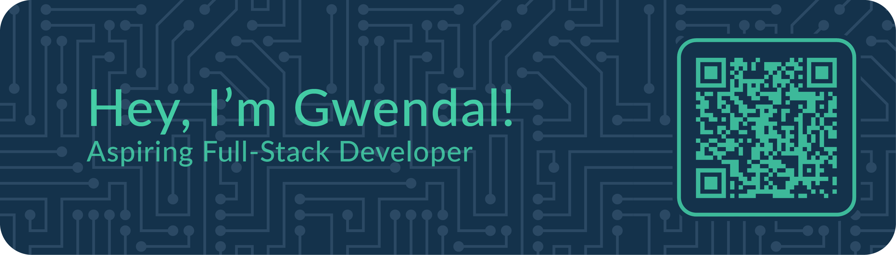

## 💫 About Me

**Junior Web & Mobile Full-Stack Developer**

As a curious and avid learner, I recently joined the programming community after graduating the Toulouse School of Architecture in 2024. I discovered Python on my own, and became deeply interested in the wide range of possibilities programming offers. This strong new interest led me to begin studying at [Holberton School](https://www.holbertonschool.com) in early 2025.

After working on fundamentals and low-level programming, I dived into higher-level languages, aiming to get a solid understanding of both front-end and back-end web development.

## 💻 Formation

- **Holberton School** - Toulouse (February 2025 - Now)\
Computer Science Fundamentals (Low-Level Programming - Back-End & Front-End Development)

- **École Nationale Supérieure d'Architecture** - Toulouse (September 2016 - June 2024)\
Master's Degree in Architecture

- **Lycée Pré De Cordy** - Sarlat-la-Canéda (September 2013 - June 2016)\
High-School Diploma (Science Major)

## 💻 Technologies

 

    <b>TOOLS</b>
      
    
    

 

    
    
    
    
     
    
    
    

 

    <b>STACK</b>
      
    

 

    
    
    
    
     
    
    
    

 

    

## 🌐 Contact

- **Mail**: [gwendalminguy@outlook.fr](mailto:gwendalminguy@outlook.fr)

- **Phone**: [+33 7 81 84 24 90](tel:+33781842490)

- **LinkedIn**: [@gwendalminguy](https://www.linkedin.com/in/gwendalminguy)

- **Instagram**: [@gwendalminguy](https://www.instagram.com/gwendalminguy)
